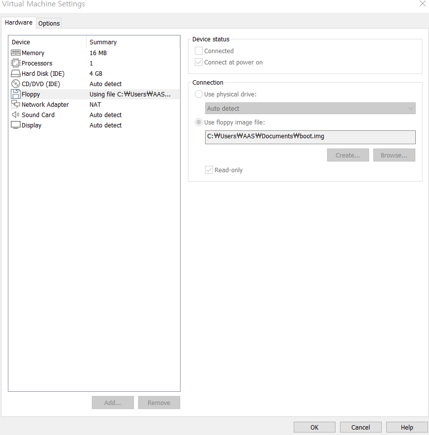

# I/O_create
I/O를 개발하는 Repository

# 용어 정리

## 램(RAM = Random Access Memory)

램은 컴퓨터의 핵심 부품이다. 자유롭게 읽고 쓸 수 있는 기억장치로, RWM(Read Write Memory)라고 부르기도 합니다. 또한 RAM에는 현재 사용 중인 프로그램이나 데이터가 저장되어 있습니다. 시스템의 전원이 꺼지면 기억된 내용이 모두 사라지는 휘발성 메모리의 특징을 가집니다. 일반적으로 주기억장치 또는 메모리라고 부르는 게 램이라고 보시면 됩니다.

## 롬(ROM = Ready Only Memory)

롬은 기억된 내용을 읽을 수만 있는 기억장치로써 일반적으로 쓰기가 불가능합니다. 또한 시스템의 전원이 꺼져도 기억된 내용이 지워지지 않는 비휘발성 메모리입니다. 실제로 롬(ROM)은 주기억장치로 사용되기보단 주로 기본 입출력 시스템, 자가 진단 프로그램 같은 변경 가능성이 없는 시스템 소프트웨어를 기억시키는데 이용됩니다.

## 바이오스(BIOS)

운영 체제중 가장 기본적인 소프트웨어이자 컴퓨터의 입출력을 처리하는 펌웨어이다. 사용자가 컴퓨터를 켜면 시작되는 프로그램으로 주변장치(키보드, 마우스)와 컴퓨터 운영체제(소프트웨어)사이의 데이터 흐름을 관리한다. 컴퓨터에 전원이 공급되면 부팅절차에서 하드웨어 초기화를 수행한다.

## 부트로더

### 부트로더란?

<b>부트로더(boot loader)</b>란 운영체제가 시동되기 이전에 미리 실행되면서, 커널이 올바르게 시동되기 위해 필요한 모든 관련 작업을 마무리하고 최종적으로 운영체제를 시동시키기 위한 목적을 가진 프로그램을 말한다.
  
추가설명 : 전원이 들어오게 되면 ROM에 들어있는 BIOS가 로드 됩니다. BIOS는 컴퓨터에 연결된 저장 매체에서 설정된 부팅순서대로 부트로더를 불러오게 됩니다.

## 커널

### 커널이란?

컴퓨터 과학에서 커널은 컴퓨터 운영체제의 핵심이 되는 컴퓨터 프로그램으로, 시스템의 모든 것을 완전히 통제한다. 운영체제의 다른 부분 및 응용 프로그램 수행에 필요한 여러가지 서비스를 제공한다. 핵심이라고도 한다. 

### 커널의 역할

1. 보안 : 커널은 컴퓨터 하드웨어와 프로세스의 보안을 책임진다.

2. 자원관리 : 한정된 시스템 자원을 효율적으로 관리하여 프로그램의 실행을 원할하게 한다. 특히 프로세스에 처리기를 할당하는 것을 스케줄링이라고 한다.

3. 추상화 : 같은 종류의 부품에 대해 다양한 하드웨어를 설계할 수 있기 때문에 하드웨어를 직접 접근하는 것은 문제를 매우 복잡하게 만들수 있다. 일반적으로 커널은 운영체제의 복잡한 내부를 감추고 깔끔하고 일관성 있는 인터페이스를 하드웨어에 제동하기 위해 몇 가지 하드웨어 추상화들로 구현된다. 

## 프로세스

### 프로세스란?

실행 중에 있는 프로그램을 의미한다. 하드디스크에 있는 프로그램을 실행하면, 실행을 위해서 메모리 할당이 이루어지고, 할당된 메모리 공간으로 바이너리 코드가 올라가게 된다. 이 순간부터 프로세스라 불린다.

### 프로세스의 메모리 구조

1. Code 영역 : 프로그램을 실행시키는 실행 파일 내의 명령어들이 올라갑니다.
2. Data 영역 : 전역 변수, Static 변수의 할당
3. Heap 영역 : 동적 할당을 위한 메모리 영역
4. Stack 영역 : 지역변수, 함수 호출시 전달되는 인자를 위한 메모리 영역

### 프로세스의 상태 변화

프로세스의 상태는 ready, blocked, running 상태가 있습니다.

## 레지스터

### 레지스터란?

레지스터는 CPU 내부에서 처리할 명령어나 연산의 중간 값 등을 일시적으로 기억하는 임시 기억장소입니다. 컴퓨터의 프로세서 내에서 자료를 보관하는 아주 빠른 기억장소라고 생각하면 되며 일반적으로 현재 계산을 수행중인 값을 저장하는데 사용됩니다. 레지스터는 메모리 계층의 최상위에 위치하면서 가장 빠른 속도로 접근이 가능하게끔 설계되어 있는 메모리 입니다.

## 펌웨어

### 펌웨어란?

펌웨어는 컴퓨팅과 공학 분야에서 특정 하드웨어 장치에 포함된 소프트웨어로, 소프트웨어를 읽어 실행하거나, 수정하는 것도 가능한 장치를 뜻한다. 하드웨어의 제어와 구동을 담당하는 일종의 운영체제이다. 

# O/S 만들기

O/S를 만들기 위해서는 가상머신인 vm ware와 어셈블리어를 컴파일 할수 있는 nasm이 필요하다.

1. nasm 설치

[nasm 설치](https://comb.tistory.com/13)를 참고했다.

2. vm ware 설치

[vm ware 설치](https://jhnyang.tistory.com/233)를 참고했다. 

설치 후 중요한것은 우리가 O/S를 만들기 위해서는 가상환경에 기존의 운영체제를 쓰면안된다는 것이다.
그래서 O/S를 선택할때 Other를 선택하여 가상환경을 만들어야한다.
마지막으로 가상환경을 만들었다면 setting에서 Floppy Disk를 추가해야한다.

